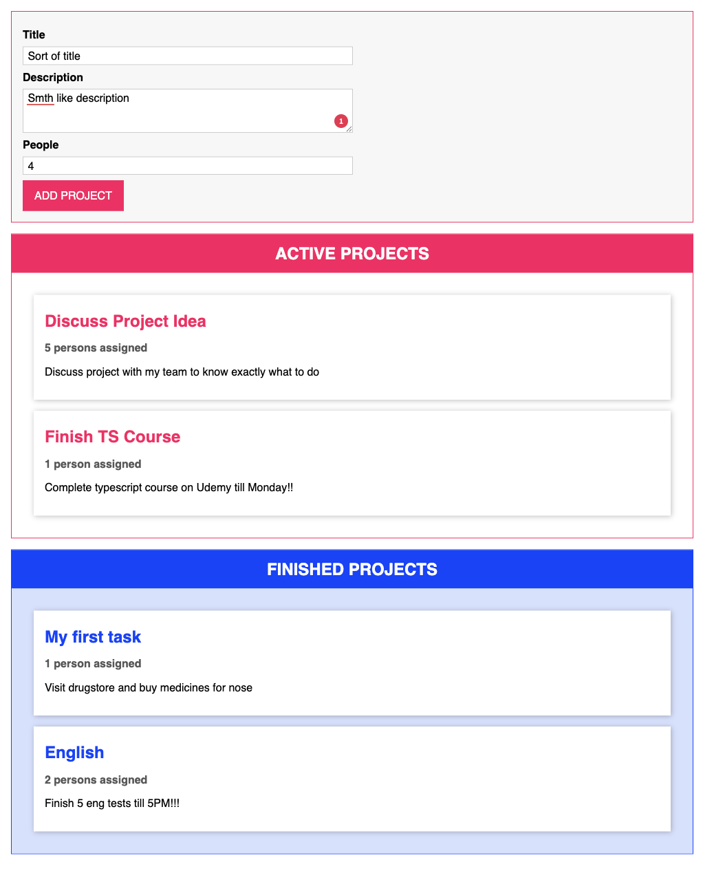

# Project Manager

A drag-and-drop project management application built with TypeScript that helps you organize your tasks between active and completed projects.

## Overview

Project Manager is a single-page application that allows users to:

- Create new projects with title, description and assigned people
- View active and finished projects in separate sections
- Drag and drop projects between active and finished states
- Validate form inputs with custom validation logic

## Technologies

- **TypeScript** - Strongly typed programming language that builds on JavaScript
- **HTML5** - Structure and templates for the application
- **CSS3** - Styling and visual effects
- **Drag and Drop API** - Native browser API for implementing drag and drop functionality
- **OOP Design Patterns** - Singleton pattern for state management
- **Decorators** - Custom TypeScript decorators for method binding

## Features

- **Project Creation Form** - Add new projects with validation
- **Drag and Drop Interface** - Intuitive project management
- **State Management** - Centralized project state with observer pattern
- **Component-Based Architecture** - Reusable UI components

## Development

This project demonstrates several advanced TypeScript concepts:

- Singletone Pattern
- Generic types
- Decorators
- Interfaces
- Abstract classes
- Type guards
- Enums

The application uses a component-based architecture with inheritance and implements the Singleton pattern for state management.
